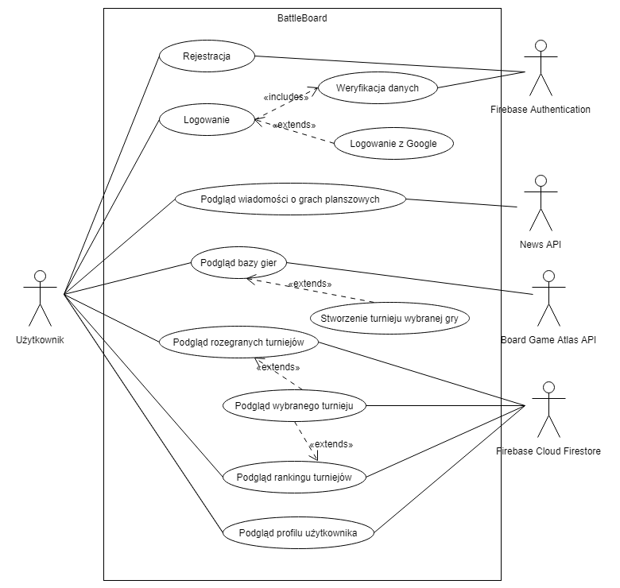

# BattleBoard
BattleBoard is an application for board game players. It allows you to create your own player account, find tournaments of favourite board games in the area, create your own tournaments and is an opportunity to meet new people!

## UML Use Case Diagram

## Configuration 
For development or just running app on local machine make sure to set your environment accordingly:
[Angular Getting started](https://angular.io/guide/quickstart)

Install Firebase library for Angular
`npm install firebase @angular/fire --save`.

## Development server

Run `ng serve --open` for a dev server. Your browser will open on `http://localhost:4200/`. The app will automatically reload if you change any of the source files.

## Further help

To get more help on the Angular CLI use `ng help` or go check out the [Angular CLI README](https://github.com/angular/angular-cli/blob/master/README.md).
